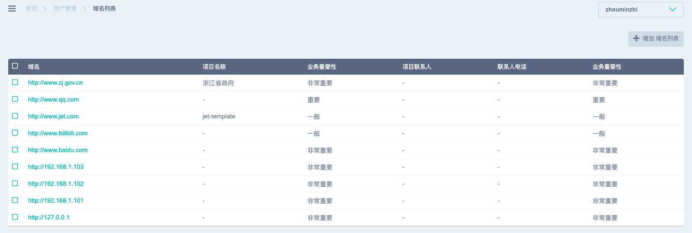
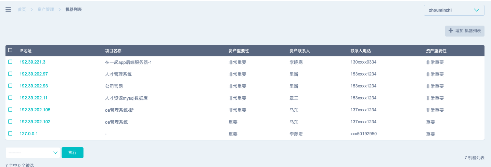
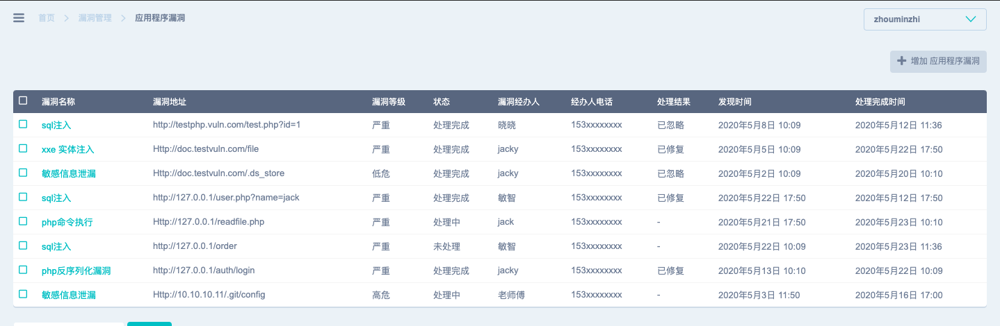
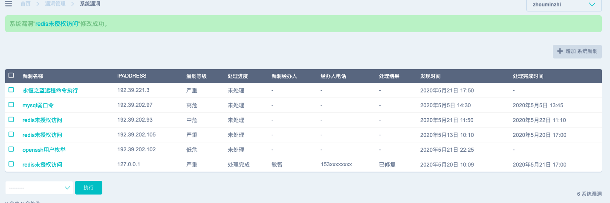

# anjianrvms
#### 基于django的漏洞与风险管理系统 : 【安鉴】

#### 现有功能

- 机器资产管理，后台手动添加
- 域名资产管理，后台手动添加
- xray webhook，运行xray webscan options --webhook-output http://127.0.0.1:8000/webhook
- web漏洞管理，当xray下一次扫描不到对应url漏洞的时候，调整状态为“已修复”。
- web漏洞管理，修复状态手动调整（已处理，未处理，已忽略），漏洞修复处置人，联系方式

#### TODO

- 主机漏洞：用nessus
- 端口风险：用nmap

#### 部分截图

域名资产管理

主机资产管理

web漏洞管理

主机漏洞管理

